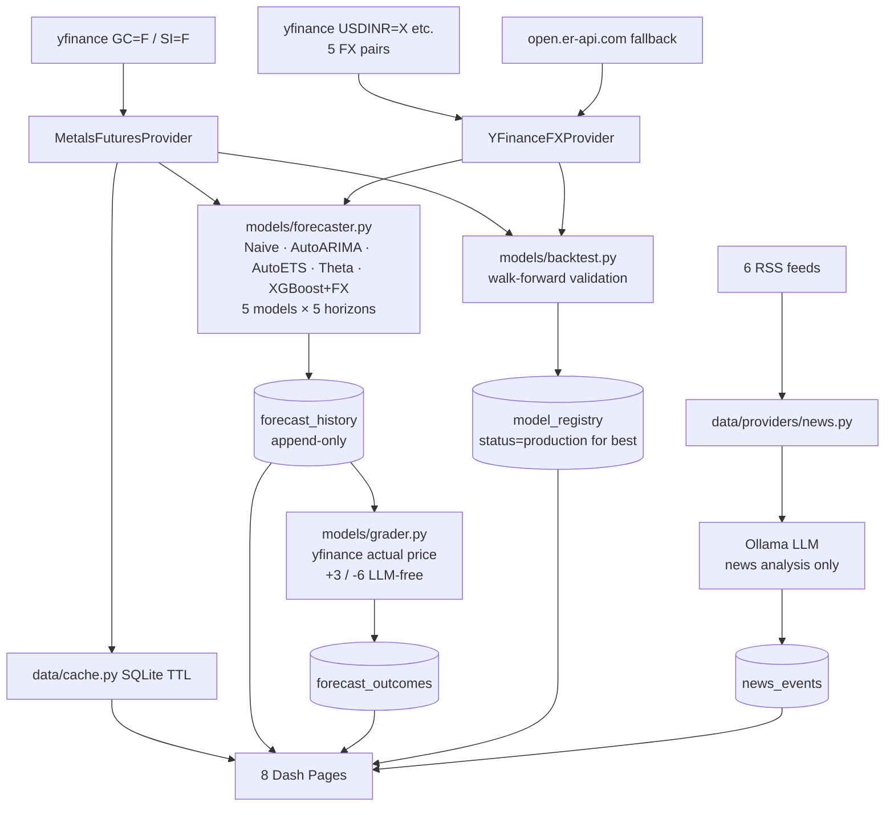
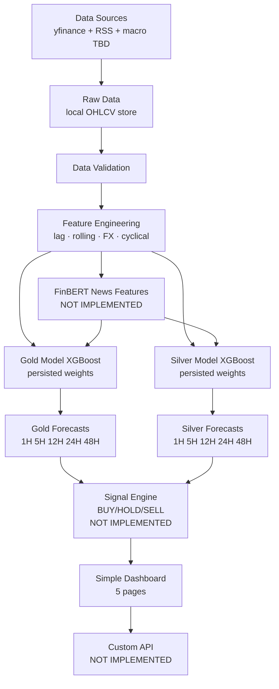

# PROMPT 2 RESULT

Commit: `feec696`

---

## Changes Made

### Files Modified

| File | What changed |
|------|-------------|
| `README.md` | Corrected page count (8 not 18); removed false claims about FinBERT, signal engine, API, persistent model weights, spot prices; added honest dashboard page list |
| `data/providers/base.py` | Removed `ProviderChain` class (dead code — never instantiated anywhere); removed unused `import time` |
| `models/forecaster.py` | Removed unused `import importlib` (line 35 in original) |
| `.gitignore` | Added `__pycache__/`, `*.pyc`, `.venv/`, `.env`, `*.log`, pytest/coverage artifacts |

### Files Created

| File | Purpose |
|------|---------|
| `tests/test_imports.py` | Verify all major modules import; confirm ProviderChain is gone |
| `tests/test_features.py` | No-leakage checks, column presence, horizon alignment, chronological index |
| `tests/test_grader.py` | +3/-6 scoring, unavailable price skipped, no re-grading, FLAT deadband |
| `tests/test_backtest.py` | No future leakage, chronological windows, skips short series |
| `docs/BASELINE_STATUS.md` | Pre-change baseline (imports, DB, Python version) |
| `docs/FX_USAGE_AUDIT.md` | Confirms JPY/INR and CHF/INR flow through UI + features + model + DB |
| `docs/MODEL_MIGRATION_PLAN.md` | Current models → future asset-specific XGBoost migration path |
| `docs/DASHBOARD_MIGRATION_PLAN.md` | 8-page current → 5-page target migration plan |

---

## Files Intentionally Preserved (Unchanged)

```
pages/overview.py       — unchanged
pages/metals.py         — unchanged
pages/markets.py        — unchanged
pages/analytics.py      — unchanged
pages/forecasts.py      — unchanged
pages/models.py         — unchanged
pages/system.py         — unchanged
pages/intelligence.py   — unchanged
models/forecaster.py    — logic unchanged (only dead import removed)
models/backtest.py      — unchanged
models/grader.py        — unchanged
models/features.py      — unchanged
data/providers/metals_futures.py — unchanged
data/providers/forex.py          — unchanged
data/providers/news.py           — unchanged
data/providers/metals_spot.py    — unchanged
data/cache.py           — unchanged
db/schema.py            — unchanged (data_quality_alerts kept; system.py reads its count)
db/ops.py               — unchanged
config.py               — unchanged
llm/ollama_client.py    — unchanged
llm/llm_registry.py     — unchanged
app.py                  — unchanged
```

---

## Dead Code NOT Removed (and why)

| Item | Kept because |
|------|-------------|
| `data_quality_alerts` table | `pages/system.py:136` reads its row count for the health dashboard |
| `insert_data_quality_alert()` | Paired with above; keep so the table can be populated in future |
| JPY/INR, CHF/INR FX pairs | Used in UI, features, XGBoost model, and DB columns — defer removal to Feature Engineering stage |

---

## Tests

```
Tests run:   24
Passed:      24
Failed:       0
Skipped:      0
Duration:    42s
```

```
tests/test_backtest.py::test_backtest_runs_without_error                 PASSED
tests/test_backtest.py::test_backtest_skips_insufficient_data            PASSED
tests/test_backtest.py::test_training_window_does_not_use_future         PASSED
tests/test_backtest.py::test_walk_forward_windows_are_ordered            PASSED
tests/test_features.py::test_returns_dataframe_and_series                PASSED
tests/test_features.py::test_no_nans_in_output                           PASSED
tests/test_features.py::test_expected_base_columns                       PASSED
tests/test_features.py::test_no_future_leakage_lag1                      PASSED
tests/test_features.py::test_target_is_horizon_steps_ahead               PASSED
tests/test_features.py::test_fx_features_added                           PASSED
tests/test_features.py::test_index_is_chronological                      PASSED
tests/test_features.py::test_get_feature_names_count                     PASSED
tests/test_grader.py::test_correct_direction_scores_plus3                PASSED
tests/test_grader.py::test_incorrect_direction_scores_minus6             PASSED
tests/test_grader.py::test_unavailable_price_not_graded                  PASSED
tests/test_grader.py::test_already_graded_not_regraded                   PASSED
tests/test_grader.py::test_flat_direction_deadband                       PASSED
tests/test_imports.py::test_config                                        PASSED
tests/test_imports.py::test_db_schema                                     PASSED
tests/test_imports.py::test_db_ops                                        PASSED
tests/test_imports.py::test_providers                                     PASSED
tests/test_imports.py::test_models                                        PASSED
tests/test_imports.py::test_llm                                           PASSED
tests/test_imports.py::test_no_provider_chain                             PASSED
```

---

## Application

```
Import (python -c "import app"):  YES
Database (init_db()):              YES
Dash startup (headless):           NOT VERIFIED — Dash requires a browser; webbrowser.open fires on launch
```

---

## Post-Cleanup Architecture (actual)



---

## Target Architecture (NOT IMPLEMENTED)



`TARGET ARCHITECTURE — NOT IMPLEMENTED YET`
