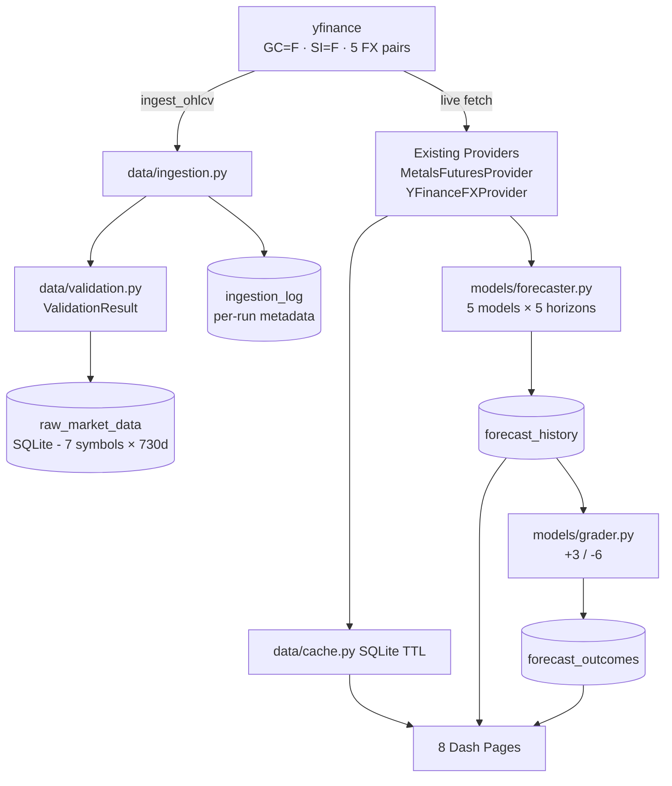

# PROMPT 3 RESULT

Commit: TBD (post-commit)

---

## Changes Made

### Files Created

| File | Purpose |
|------|---------|
| `data/validation.py` | `ValidationResult` dataclass + `validate_ohlcv()` |
| `data/ingestion.py` | `ingest_ohlcv()`, `get_latest_stored_ts()`, `backfill()`, `update_incremental()` |
| `tests/test_validation.py` | 8 validation tests — no network |
| `tests/test_ingestion.py` | 8 ingestion tests — yfinance mocked |
| `docs/PROMPT_3_DATA_PLAN.md` | Implementation plan written before coding |

### Files Modified

| File | What changed |
|------|-------------|
| `db/schema.py` | Added `raw_market_data` and `ingestion_log` tables to SCHEMA constant |

---

## New Tables

### `raw_market_data`
```
symbol, asset, data_type, interval, timestamp_utc,
open, high, low, close (NOT NULL), volume, source, ingested_at
UNIQUE(symbol, timestamp_utc, interval) — guarantees idempotent INSERT OR IGNORE
INDEX idx_raw_symbol_ts (symbol, timestamp_utc) — fast range queries
```

### `ingestion_log`
```
ingested_at, symbol, asset, interval, source,
first_timestamp, last_timestamp,
rows_received, rows_stored, rows_duplicate, rows_invalid,
validation_status ("OK" | "WARNINGS" | "FAILED"), error_message
```

---

## Validation Policy

| Condition | Action |
|-----------|--------|
| Empty DataFrame | status=FAILED, return empty |
| Missing `close` column | status=FAILED, return empty |
| close is NaN | Row excluded (rows_invalid++) |
| close ≤ 0 | Row excluded (rows_invalid++) |
| Duplicate timestamps | First kept, rest excluded (duplicate_timestamps++) |
| OHLC inconsistency (high < max(O,C,L)) | Row kept, flagged (invalid_ohlc_rows++) |
| Timestamp gap > 48h | Counted, flagged (large_gap_count++) — weekends are normal |

Status escalation: OK → WARNINGS if any issues; FAILED only if no usable rows.

---

## Ingestion Logic

**Full backfill** (`backfill(lookback_days=730)`):
- Calls `ingest_ohlcv` for all 7 symbols
- `get_latest_stored_ts()` returns None → `yf.Ticker.history(period="730d", ...)`

**Incremental** (`update_incremental()`):
- `get_latest_stored_ts()` returns datetime → `yf.Ticker.history(start=latest_ts - 1h, ...)`
- The −1h overlap re-fetches the last stored bar; INSERT OR IGNORE discards it
- Existing forecasting/backtest pipeline is completely unchanged

---

## What Was NOT Changed

```
app.py                           — unchanged
pages/ (all 8)                   — unchanged
models/ (forecaster, backtest, grader, features) — unchanged
data/providers/ (all 4)          — unchanged
data/cache.py                    — unchanged
db/ops.py                        — unchanged
config.py                        — unchanged
llm/                             — unchanged
```

---

## Tests

```
Tests run:   41
Passed:      41
Failed:        0
Warnings:      0
Duration:    ~21s
```

```
tests/test_backtest.py      4 PASSED  (existing — unchanged)
tests/test_features.py      8 PASSED  (existing — unchanged)
tests/test_grader.py        5 PASSED  (existing — unchanged)
tests/test_imports.py       7 PASSED  (existing — unchanged)
tests/test_ingestion.py     8 PASSED  (NEW)
tests/test_validation.py    9 PASSED  (NEW)
```

---

## Post-Prompt-3 Architecture



**raw_market_data is a parallel store — not yet wired into forecasting.**
The forecasting pipeline continues to use live yfinance fetches.
Wiring raw_market_data into training is Prompt 4 scope.
